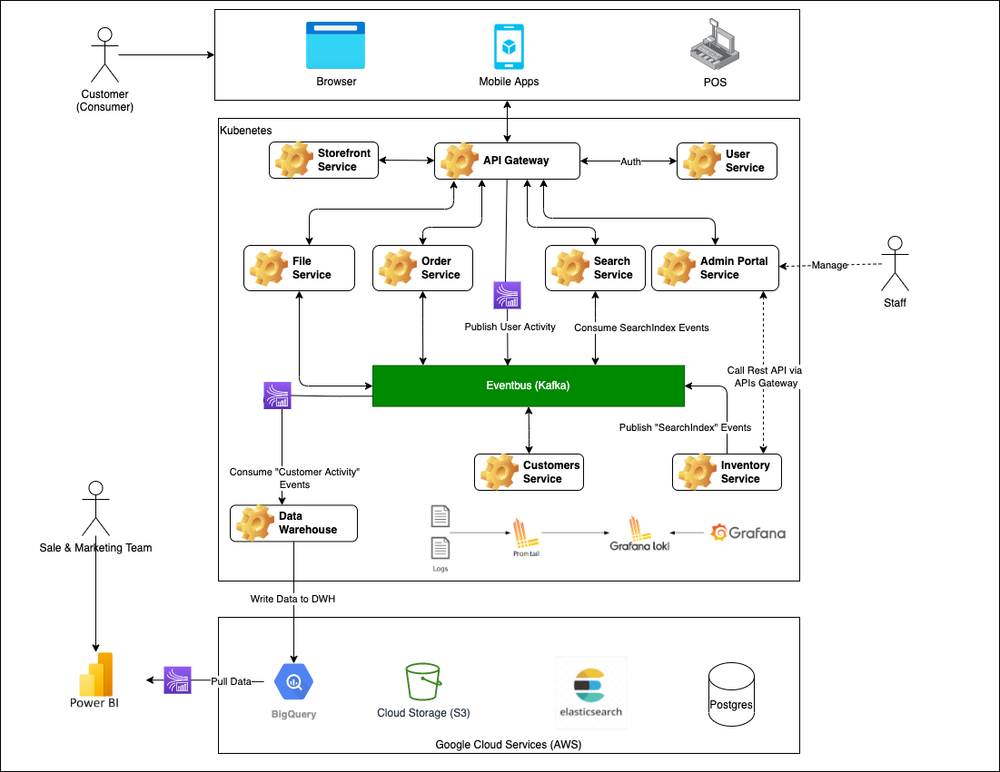

# Overview Architecture

## Services Map

## Tech Stacks

### Architech:
- Microservices
- CQRS (Command Query Responsibility Segregation)
- Event Sourcing

### Deployment Stacks
- [x] DNS and DDOS Protection with Cloudflare
- [x] Kubenates
- [x] GCP - Bigquery (AWS Redshift)
- [x] GCP - Cloud Store (AWS S3)
- [x] GCP - Cloud SQL (AWS RDS)
- [x] ES cloud (AWS OpenSearch)
- [x] Security with OpenVPN
- [x] Ansible to Devops automation
- [x] Teraform to IaC
- [ ] Anthos (Multi-Cloud)

### Service's Communicate:

- [x] Event Sourcing (Kafka, ~~RabbitMQ~~, ~~Redis~~)
- [x] REST APIs
- [x] gRPC
- [ ] Socket.IO

### Storage: 
- [x] PostgreSQL, ~~Mysql~~
- [x] Minio (Interface for AWS S3, Cloud Store - GCP, others...)
- [x] BigQuery
- [x] ElasticSearch
- [x] MemCache
- [ ] Redis

## Search Engine:
- [x] Elastic Search
- [ ] Solr
- [ ] Algolia
- [ ] MongoDB

## Cache: 
- [x] memcache
- [x] Redis

## Observability vs Monitoring: 
- [x] Grafana Loki, ~~ELK, Datadog, newrelic~~ 
- [x] Promithius
- [x] Grafana Tempo (Distributed tracing)
- [x] Grafana Oncall (Alertmanager integrate to email and slack)

## Backup: 
- [ ] DB Replica delay 1 day compage to the master.
- [ ] Daily cronjob dump DB, zip, encrypt and store in S3